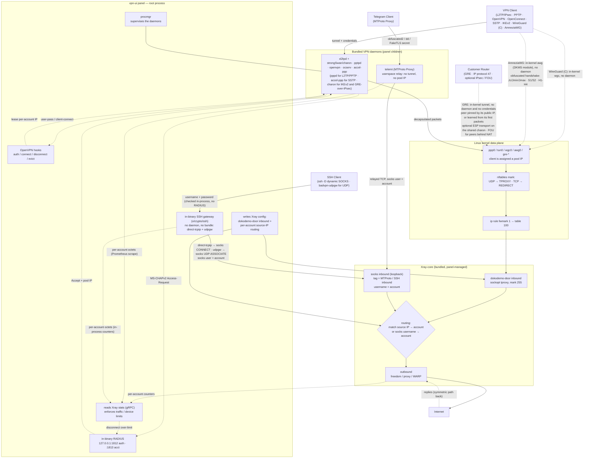
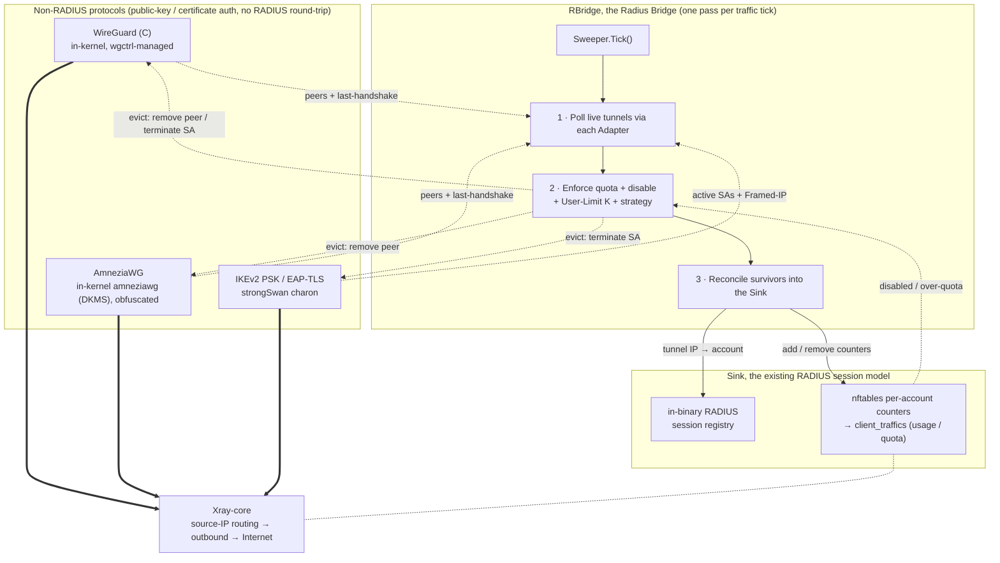

[English](/docs/README_EN.md) | [فارسی](/docs/README_FA.md) | [العربية](/docs/README_AR.md) | [中文](/docs/README_ZH.md) | [Español](/docs/README_ES.md) | [Русский](/README.md) | [Türkçe](/docs/README_TR.md)

<p align="center">
  
</p>

Este proyecto es una versión mejorada del panel **[3X-UI](https://github.com/MHSanaei/3x-ui)** (versión 2.9.3). El objetivo de este proyecto es agregar diversos protocolos y ofrecerlo como un panel integral con soporte para las funciones de **Xray-core**.


## Nuevos protocolos

- PPTP
- L2TP (RAW)
- L2TP/IPsec
- OpenVPN
- OpenConnect (cisco)
- SSTP
- IKEv2
- WireGuard (C)
- AmneziaWG (WireGuard ofuscado)
- GRE (túneles site-to-site entre routers, opcionalmente sobre IPsec)
- MTProto Proxy (Telegram)
- SSH

## Nuevas funcionalidades

- **Multiadministrador** con acceso por Inbound: cada administrador solo ve los Inbounds que le asignes
- Cuentas de **Revendedor** con un saldo de tráfico medido que recarga un administrador, gastable solo en los Inbounds que se le hayan dado
- Función **Client to Client**, incluso como **Cross Inbound** (conexión interna de un usuario L2TP con un usuario OpenVPN)
- Incorporación de los **Encryption** **AES-256-GCM** y **AES-128-GCM** al protocolo **Shadowsocks**
- Soporte para **XHTTP Object** en el **Inbound** y el **Outbound**
- Script de instalación automática de **[WARP-CLI](https://github.com/Sir-MmD/warp-cli)** (la versión oficial de Cloudflare)
- Núcleo [**Xray-core** parcheado](https://github.com/Sir-MmD/Xray-core) para solucionar el error «Unsupported Cipher» en el protocolo **Shadowsocks**
- Empaquetado de todos los archivos (Geofile, Xray-core y los núcleos del Backend) dentro de un único archivo binario
- Exportación de los enlaces de las cuentas en formato **TXT** y **PDF**
- Posibilidad de **congelar (Freeze)** cuentas
- Incorporación de **checkbox** a los clientes y a los Inbound
- Función **Bulk Operation**:
    * Cambio grupal del volumen de datos de las cuentas
    * Cambio grupal de los días de las cuentas
    * Activación/desactivación grupal de cuentas
    * Eliminación grupal de cuentas
    * Eliminación grupal de Inbounds
    * **Congelar/Descongelar** cuentas de forma grupal

## Sistemas operativos probados


| | Distribución |Versión |Versión |
|:---:|:---|:---:|:---:|
|  | **Ubuntu** | `24.04` | `26.04` |
|  | **Debian** | `12` | `13` |
|  | **Fedora** | `43` | `44` |
|  | **AlmaLinux** | `9` | `10` |
|  | **Rocky Linux** | `9` | `10` |
|  | **CentOS Stream** | `9` | `10` |
|  | **Arch Linux** | `Rolling` | |


> [!IMPORTANT]
> Se recomienda instalar el panel siempre en los sistemas operativos probados, ya que es muy probable que los nuevos núcleos no funcionen correctamente en los demás sistemas operativos.

> [!NOTE]
> **AmneziaWG solo funciona en Debian 12/13 y Ubuntu 24.04/26.04.**
> A diferencia del resto de protocolos, AmneziaWG no está incluido en el núcleo de ninguna distribución: el panel compila su módulo de núcleo en tu servidor durante la configuración inicial. Actualmente ese módulo falla al compilarse en dos casos. En **el núcleo 7.1 o posterior** (Fedora 43/44, Arch) el núcleo eliminó el símbolo `ipv6_stub` que el módulo todavía utiliza. En **AlmaLinux, Rocky Linux y CentOS Stream** los núcleos de RHEL con parches retroportados chocan con la capa de compatibilidad del módulo, y EL10 no es reconocido por ella en absoluto. Ambos casos son limitaciones del módulo original de AmneziaWG, cuyas correcciones siguen pendientes en el proyecto original, así que no son algo que el panel pueda resolver mediante configuración.
> La configuración inicial lo detecta y te avisa, en lugar de fallar en silencio. **El resto de protocolos funcionan con normalidad en todos los sistemas operativos probados.**

## Instalación del panel

```bash
curl -Ls https://raw.githubusercontent.com/tonulls/vpn-ui/refs/heads/tonulls/deploy.sh | sudo bash
```

## Desinstalación del panel

```bash
sudo /opt/vpn-ui/vpn-ui-amd64 --uninstall
```

> [!NOTE]
> La ruta de la base de datos, el servicio **systemd** y todos los puertos predeterminados han cambiado, así que puedes instalar este panel junto a tus otros paneles sin ningún problema.

## Comandos útiles
◾ Comprobar el estado del servicio:
```bash
sudo systemctl status vpn-ui.service --no-pager
```
◾ Seguir el registro del panel en tiempo real:
```bash
sudo journalctl -u vpn-ui.service -f
```
◾ Comprobar la versión instalada del panel:
```bash
sudo /opt/vpn-ui/vpn-ui-amd64 -v
```

## Cómo interactúan los nuevos protocolos con el núcleo de Xray-core



## Cómo RBridge integra los protocolos sin RADIUS

WireGuard (C), AmneziaWG y los modos **PSK** / **EAP-TLS** de IKEv2 se autentican con una clave pública o un certificado, por lo que nunca hacen un intercambio con RADIUS y, de otro modo, no tendrían registro de sesión, ni contabilidad de tráfico, ni aplicación del **User Limit**. **RBridge** (Radius Bridge) cubre ese hueco: una vez por cada ciclo de tráfico, su **Sweeper** sondea (poll) los túneles activos de cada protocolo, aplica la cuota (quota), la desactivación y el **User Limit** K por cuenta (expulsando a los sobrantes con evict) y luego reconcilia a los supervivientes en el mismo registro de sesiones **RADIUS** integrado y la misma contabilidad basada en **nftables** que ya usan los protocolos RADIUS. Así, un protocolo basado en claves se comporta igual en uso, cuota y límite de dispositivos, y sale a Internet por el mismo plano de datos **dokodemo-door** de Xray.

En los dos protocolos de túnel basados en claves, **WireGuard (C)** y **AmneziaWG**, un **User Limit** de K reserva K ranuras de dispositivo por cuenta: K pares de claves, K configuraciones y K direcciones IP de túnel distintas, con una configuración por dispositivo. Es el mismo modelo que usan los proveedores comerciales, y es lo que permite usar una sola cuenta a la vez en un teléfono, un portátil y un router sin que los dispositivos se peleen por una única clave.



## Compilación desde el código fuente

```bash
git clone --branch tonulls https://github.com/tonulls/vpn-ui.git && cd vpn-ui
./build.sh
```

## Prueba E2E


Se ha diseñado para este proyecto una prueba **E2E** completa en Python dentro de la carpeta `test_unit`, que puedes utilizar. Los pasos son los siguientes:

1. Entra en la carpeta `test_unit` e introduce la configuración que desees en `config.toml`.
2. Ejecuta el script `setup.sh`.
3. Coloca el archivo binario compilado dentro de la carpeta `test_subject`.
4. Ejecuta `run.sh` con permisos de `sudo`.

> [!IMPORTANT]
> La prueba E2E completa consume muchísimo tiempo; si solo hiciste un cambio pequeño en el proyecto, es mejor que pruebes únicamente esa parte con el switch `--tests`:

| Test ID | Description |
| :--- | :--- |
| `core-init` | provision kernel modules + packages + xray core |
| `server-setup` | create inbounds + accounts + source-IP routing rules |
| `openvpn` | connect variants + checks + peer reachability (OpenVPN) |
| `l2tp` | connect variants + checks + peer reachability (L2TP/IPsec) |
| `pptp` | connect variants + checks + peer reachability (PPTP) |
| `openconnect` | connect variants + checks + peer reachability + same-NAT user-limit (OpenConnect/ocserv) |
| `sstp` | connect variants + checks + peer reachability (SSTP/accel-ppp, PPP-over-TLS) |
| `ikev2` | connect + checks + peer reachability (IKEv2/IPsec, strongSwan charon; eap-mschapv2 + psk + eap-tls) |
| `wg-c` | connect + checks + peer reachability + per-account usage/termination (WireGuard C, in-kernel wgctrl, gateway /29, + preshared-key mode) |
| `awg` | connect + checks + peer reachability + per-account usage/termination (AmneziaWG, in-kernel amneziawg DKMS module, obfuscation params, + preshared-key mode) |
| `gre` | connect + checks + peer reachability + per-account usage/termination (GRE site-to-site, in-kernel ip_gre; raw / IPsec / FOU peer modes, static and dynamic peers) |
| `mtproto` | alias: runs every MTProto phase below (MTProto Proxy, telemt) |
| `mtproto-classic` | handshake + relay to a real Telegram DC + wrong-secret control + usage (obfuscated2) |
| `mtproto-secure` | same, "dd" random-padding secret |
| `mtproto-tls` | same + FakeTLS ServerHello HMAC verified, "ee" secret |
| `mtproto-toggle` | editing an account's modes takes effect on the RUNNING daemon (no restart) |
| `mtproto-termination` | quota auto-disables the account AND the proxy stops relaying for it |
| `mtproto-adtag` | an ad tag forces middle-proxy egress and drops the inbound's Xray routing, and clearing it restores both |
| `ssh` | connect + checks + routing + user-limit + both strategies + per-account usage/termination (SSH relay, in-binary Go gateway) |
| `ssh-udp` | UDP through the relay: udpgw terminated in-process and bridged to Xray via SOCKS5 UDP ASSOCIATE, plus accounting |
| `bulk-ops` | bulk client add/sub/enable/disable + TXT/PDF export via API |
| `backup-restore` | DB export + import round-trip |
| `warp-socks` | Cloudflare warp-cli SOCKS install + egress |
| `random-cfg` | `--random` switch: randomize port + creds + webpath, then restore |
| `systemd` | `--systemd` switch: install + run the panel as a systemd unit |
| `uninstall` | `--uninstall` switch: install everything, tear down, assert clean host |
| `export-js` | host-side Node TXT/PDF export test (no VM) |

Para probar solo en un sistema operativo específico, también puedes usar el switch `--only`:

```bash
sudo ./run.sh --only ubuntu-24
```

## Donate

🔹EVM:      ``0x6Ad56B8C723140ACb43F6070Af2102A98F28A72C``

🔹BTC:      ``bc1qvp9mx5w6m0gv022p0xdde5qqmzfyd4yuys6c93``

🔹TRON:     ``TLLUSBZBLb7x994TH1eYrDZhmLFPBLZSrv``

🔹SOLANA:   ``8p5FjXzNYraUvckfzNt37ZRCzx36pd2SWdVvRErTkMyH``

🔹GRAM-TON: ``UQD1gNMVhlJewKXMUY1E3_bedZsc-ktzt8ZxZCUhzrcEcPyg``

🔹USDT-TON: ``UQD1gNMVhlJewKXMUY1E3_bedZsc-ktzt8ZxZCUhzrcEcPyg``

🛠️ Modificado con ayuda de Codex
